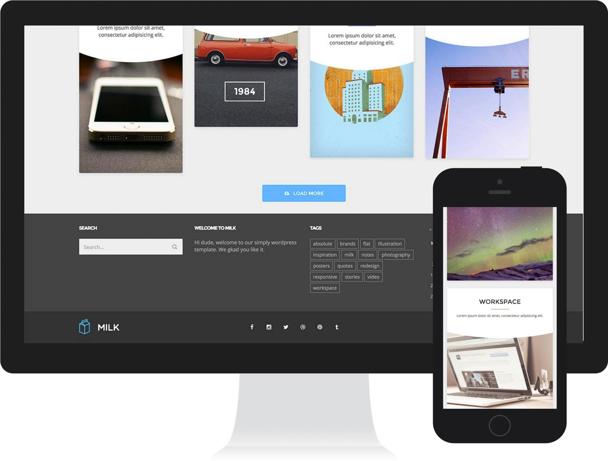

Webpage portfolio plugin
=====================

The Webpage portfolio plugin is a non JavaScript based plugin that allows you to drop a full screengrab of a webpage into the confines of an iMac and iPhone. You can then scroll the screengrab within the iMac/iPhone and mirror exactly how a user would view a webpage. This is great for portfolios and and people who want to demo a full webpage with a smart container.

The screengrab plugin I used to get the full image of a webpage is called [Nimbus screenshot and screengrab] (https://chrome.google.com/webstore/detail/nimbus-screenshot-and-scr/bpconcjcammlapcogcnnelfmaeghhagj?hl=en) and can be installed as a Chrome plugin.

### Future

Make the Webpage portfolio mobile friendly!
